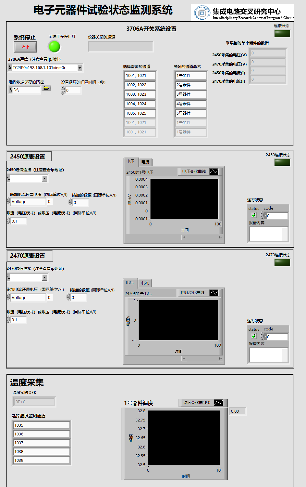

A LabVIEW-based monitoring and data-logging system for electronic component testing, built around **Keithley 2470 / 2450 SourceMeters** and a **Keithley 3706A System Switch** (switching/scanning). The software automates **multi-channel DUT scanning**, captures **voltage/current** from both SMUs, optionally collects **temperature channels**, and stores time-stamped records for reliability and degradation experiments.

> Typical use cases: device characterization, long-duration stress tests, power-cycling related electrical tracking, and multi-DUT screening where repeatable, unattended measurement is required.

------

## Key Features

- **Multi-DUT scanning via Keithley 3706A**
  - User-defined channel lists/pairs (e.g., DUT1: CH1 & CH21, DUT2: CH2 & CH22, …).
  - Sequential close/open scanning with configurable dwell/loop time.
- **Dual SourceMeter support (Keithley 2470 + 2450)**
  - Set source mode (V/I) and compliance limits.
  - Read back measured **V/I** from both instruments for cross-checking and redundancy.
- **Real-time dashboard**
  - Connection status indicators for 3706A/2470/2450.
  - Live plots (voltage/current trends) and run status/error code display.
- **Data logging**
  - Automatically saves time-stamped measurements to disk (CSV/Excel-compatible).
  - Supports continuous runs for long-term tests.
- **Safe stop / reset workflow**
  - On stop, opens all switch channels and turns off outputs to reduce risk to DUTs and instruments.

------

## Hardware Setup

- Keithley **3706A System Switch** (typically with a switching card, e.g., 3721, used in **switch-only** mode)
- Keithley **2470 SourceMeter**
- Keithley **2450 SourceMeter**
- DUT fixture / cabling and (optional) **temperature sensors** routed to selected switch channels

------

## Measurement & Scanning Workflow (3706A + 2470/2450)

The system follows a deterministic scan loop:

1. **Initialize & Connect**
   - Connect to 3706A and both SMUs via VISA (TCPIP/USB/GPIB depending on your setup).
   - Optional: reset instruments and ensure a known safe state (outputs OFF, channels OPEN).
2. **Configure Test Parameters**
   - Choose **source mode** (Voltage or Current) and set **setpoint** and **compliance** for each SMU.
   - Select **scan channel pairs** (each pair corresponds to one DUT path through the 3706A).
   - Set the **scan interval / loop delay** and the **data save path**.
3. **Scan Loop**
    For each DUT channel pair in the list:
   - Close the switch pair on the **3706A** (route DUT).
   - Enable outputs / apply stimulus (if required).
   - Acquire measurements:
     - From **Keithley 2450**: measured voltage & current
     - From **Keithley 2470**: measured voltage & current
     - Optional: read **temperature channel(s)** associated with the DUT
   - Log a time-stamped record (DUT ID, channel pair, readings, status).
   - Open the switch pair and proceed to the next DUT.
4. **Stop / Shutdown**
   - Open all channels on the 3706A.
   - Turn OFF both SMU outputs.
   - Flush/close the data file safely.

This design supports repeatable multi-DUT monitoring while keeping the switching sequence explicit and auditable.

------

## Data Output (Example)

Typical columns you may log (adjust to your implementation):

- Timestamp
- DUT_ID / Channel_Label
- 3706A_ChannelPair (e.g., 1–21, 2–22, …)
- SMU2450_V, SMU2450_I
- SMU2470_V, SMU2470_I
- Temperature (optional)
- Status / ErrorCode

All outputs are **Excel-compatible** (CSV recommended for robustness).
